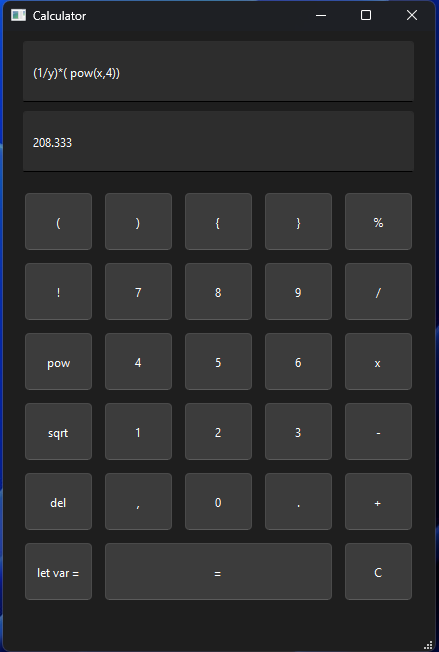

## Overview

This was the combination of a parsing calculator that was created while working through Bjarne Stroustrup's Programming Principles and Practice Using C++ and practicing Qt.

## Functionality

Supports:

* factorials
* powers
* square roots
* modulus remainder
* division
* multiplication
* subtraction
* addition
* variable declaration
* brackets and parentheses
* decimal numbers
